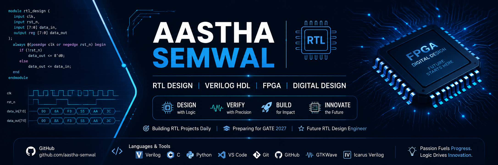

  

# Hi there 👋, I'm Aastha Semwal

## 🎓 About Me

- 🎓 B.Tech Electronics & Communication Engineering (ECE)
- 💻 Passionate about RTL Design & Digital Electronics
- 🌱 Currently learning Verilog HDL and FPGA Design
- 🎯 Goal: Become an RTL Design Engineer
- 📚 Preparing for GATE 2027

---

## 🛠️ Tech Stack

### Languages
- Verilog HDL
- C
- Python (Basics)

### Tools
- VS Code
- Git
- GitHub
- GTKWave
- Icarus Verilog

### Hardware
- Digital Electronics
- UART
- SPI
- I²C
- FIFO
- FSM Design

---

## 🚀 Current Learning Journey

✔ Logic Gates

✔ Multiplexers

✔ ALU

✔ Flip-Flops

✔ Registers

✔ Counters

✔ UART

✔ SPI

✔ FIFO

✔ I²C Master Controller

---

## 📂 Featured Repository

⭐ RTL-Learning

Daily Verilog RTL Design Projects

---

## 🎯 2026 Goals

- Complete 50+ RTL Projects
- Learn FPGA Design
- Build SoC-Level Projects
- Crack GATE 2027
- Prepare for RTL Design Interviews

---

Thanks for visiting my profile! 😊
